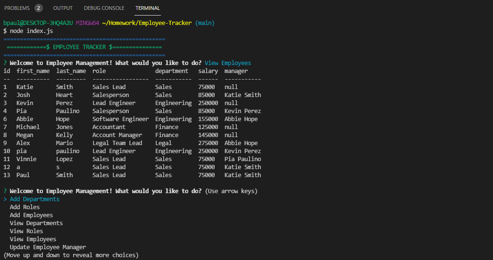

# Employee-Tracker

## Objective:
Architect and build a solution for managing a company's employees using node, inquirer, and MySQL.

## Details:

Building a command-line application that at a minimum allows the user to:

  * Add departments, roles, employees

  * View departments, roles, employees

  * Update employee roles

  As a business owner:

    I want to be able to view and manage the departments, roles, and employees in my company
    So that I can organize and plan my business

  ------
https://github.com/Maripia12/Employee-Tracker

  

